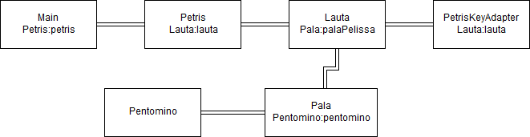

# TetrisHero
Petris, classic Tetris with pentominos instead of tetrominoes. Course project (University of Helsinki)
(in Finnish)

Aiheeksi on valittu klassisen Tetriksen muunnelma Petris, jossa perinteiset neliosaiset palat on korvattu viisiosaisilla paloilla. Harjoitustyön on tarkoitus tutustuttaa tekijä Java 2D pelien koodaamiseen ja samalla myös yleisemmin pelien koodaamiseen.

Valitsin Tetriksen, koska se oli omille taidoille todella haastava, mutta kuitenkin täysin toteutettavissa ja ymmärrettävissä mallipelejä opiskelemalla. Uskon, että näin opin huomattavasti enemmän, kuin että olisin vain lähtenyt tekemään ainoastaan niitä asioita, mitä jo entuudestaan osasin.

Mallia pelin tekemiseen ja aiheen opiskeluun on otettu:

http://zetcode.com/tutorials/javagamestutorial/tetris/

https://www.youtube.com/watch?list=PL_CeQH2n4d4EKwNT_06xeddHWsLYEX0nV&time_continue=994&v=VEzg_9B1KB0

https://www.youtube.com/watch?v=qPRWYyl41oQ

Luokkakaavio

Sekvenssikaavio
(Hahmotelma, toisaalta Petriksellä käyttötapaukset ovat käytännössä aina samoja)

Dokumentaatio

linkit:

[aiheen kuvaus](Dokumentaatio/AiheenKuvausJaRakenne.md)

[tuntikirjanpito](Dokumentaatio/Tuntikirjanpito.md)

[pit-raportit](Dokumentaatio/pit)

[checkstyle-raportti](Dokumentaatio/checkstyle)

[Käyttöohjeet](Dokumentaatio/Kayttoohjeet)

[Testauksen dokumentaatio](Dokumentaatio/Testausdokumentaatio)

